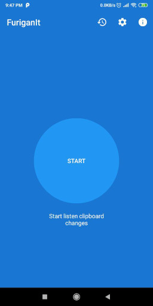
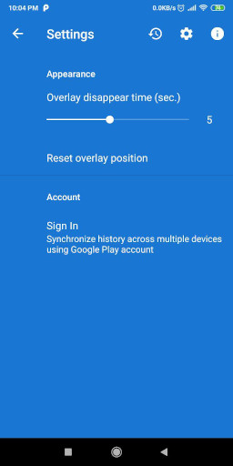
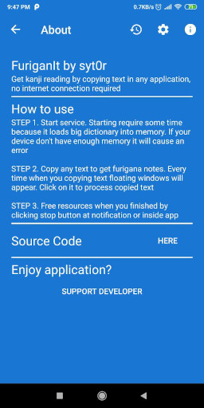
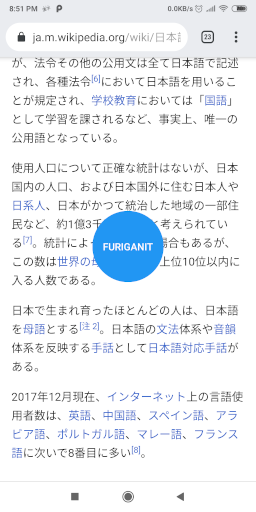
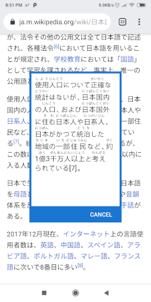

# FuriganIt

## Description 

With FuriganIt you can easily get kanji reading at any app or website - just copy text and pop-up window will appear. 
View any japanese text with furigana notes just by copying it to clipboard .
And all of that can be done without internet connection.

FuriganIt use libraries: 
* kuromoji-core
* kuromoji-ipadic

## Screenshots

## Build Status

## Download

